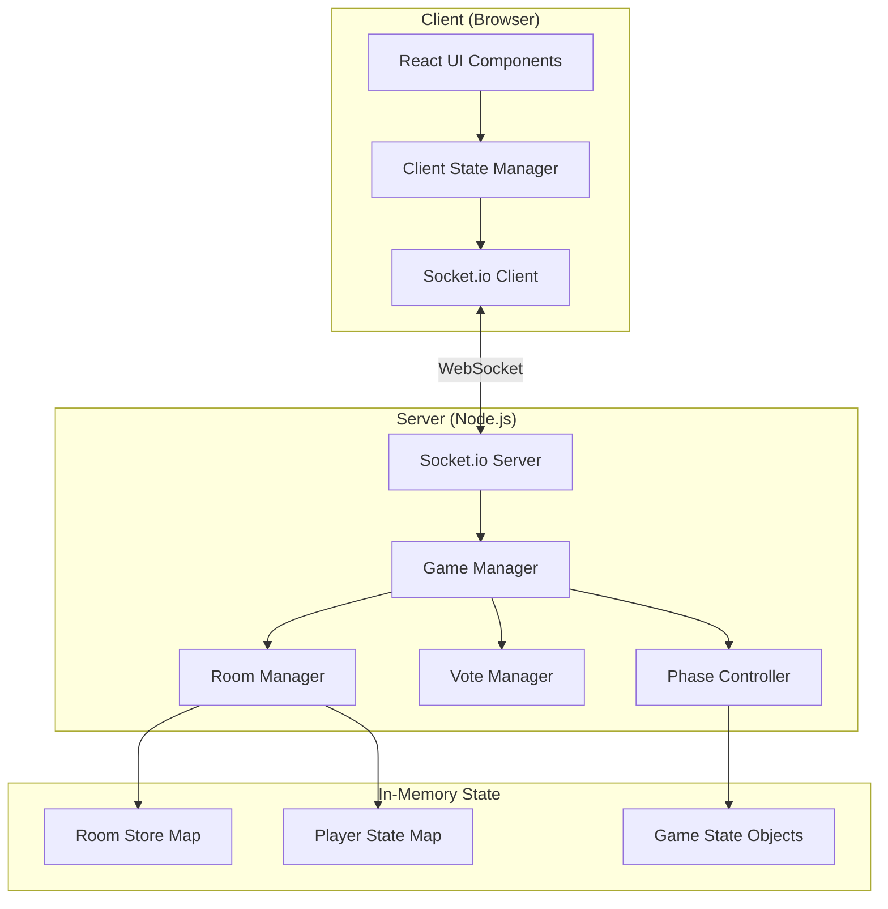

# Technical Design Document

## Overview

The Mafia Companion Web App is a real-time, mobile-first social deduction game where players physically co-located use their smartphones as personal game interfaces. The system architecture follows a strict client-server model where the server maintains authoritative game state and orchestrates all game flow, while clients act as thin display and input layers.

### Core Design Principles

1. **Server Authority**: The server is the single source of truth for all game state. Clients never compute game outcomes, phase transitions, or win conditions independently.

2. **Real-Time Synchronization**: Socket.io provides persistent bidirectional connections enabling immediate state propagation to all clients.

3. **In-Memory State Management**: All game state resides in server memory using JavaScript Maps and objects, eliminating database dependencies for the MVP.

4. **Mobile-First Interface**: The UI is optimized for smartphone viewports (320-480px) with large touch targets (minimum 44x44px) and a dark theme.

5. **Automated Game Flow**: The server orchestrates all game phases, role assignments, night action resolution, voting mechanics, and win condition checks without human intervention.

### Game Flow Summary

The game progresses through eight distinct phases:

1. **Lobby**: Players join via room code; host starts when 4-10 players present
2. **RoleReveal**: Server assigns one Killer, one Medic, remaining Civilians; players acknowledge privately
3. **Night**: Killer selects kill target, Medic selects save target, Civilians wait
4. **Morning**: Server resolves night actions and displays cinematic narration
5. **Discussion**: Timed deliberation phase (configurable, default 120s)
6. **Voting**: Living players vote to eliminate a suspect
7. **Results**: Server reveals eliminated player and their role
8. **GameOver**: Win condition detected, host can replay

---

## Architecture

### System Components



### Communication Patterns

**Client-to-Server Events**:
- `createRoom` - Create new game room
- `joinRoom` - Join existing room by code
- `startGame` - Host initiates game start
- `submitKill` - Killer submits night target
- `submitSave` - Medic submits protection target
- `submitVote` - Player submits elimination vote
- `skipDiscussion` - Host skips to voting
- `replayGame` - Host restarts from lobby
- `narrationComplete` - Client finished displaying narration

**Server-to-Client Events**:
- `roomUpdated` - Room state changed (player join/leave, host change)
- `gameStarted` - Game beginning, roles being assigned
- `roleAssigned` - Private role assignment to individual player
- `phaseChanged` - Game phase transition with state snapshot
- `morningNarration` - Night outcome with narrative segments
- `votingOpened` - Voting phase begun
- `voteResults` - Vote tallied, results available
- `playerEliminated` - Player eliminated with role reveal
- `gameOver` - Game ended with winner and all roles
- `error` - Action rejected with descriptive message

### Technology Stack

**Server**:
- Node.js (runtime)
- Socket.io (real-time communication)
- Express.js (HTTP server for static file serving)

**Client**:
- React (UI framework)
- Socket.io-client (real-time communication)
- CSS3 with Flexbox/Grid (responsive layout)

**Development/Testing**:
- Property-based testing library (to be selected based on language choice)
- Jest or Vitest (unit testing)
- Playwright or Cypress (integration testing)

---

## Components and Interfaces

### Server Components

#### GameManager

**Responsibility**: Orchestrates all active game rooms and delegates phase-specific logic.

**Interface**:
```typescript
interface GameManager {
  createRoom(playerName: string): { roomCode: string; hostId: string } | Error;
  joinRoom(roomCode: string, playerName: string): Room | Error;
  startGame(roomCode: string, requesterId: string): void | Error;
  handleDisconnect(playerId: string): void;
  handleReconnect(roomCode: string, playerName: string, socketId: string): void | Error;
  getRoom(roomCode: string): Room | null;
}
```

**Key Behaviors**:
- Generates unique 6-character uppercase alphanumeric room codes (up to 10 attempts)
- Validates player name length (1-32 chars for host, 1-20 chars for join)
- Enforces room capacity (4-10 players)
- Manages host delegation when host disconnects in Lobby
- Retains disconnected player state for 60 seconds

#### RoomManager

**Responsibility**: Manages room lifecycle, player roster, and name uniqueness.

**Interface**:
```typescript
interface RoomManager {
  createRoom(hostName: string): Room;
  addPlayer(room: Room, playerName: string, socketId: string): Player | Error;
  removePlayer(room: Room, playerId: string): void;
  isNameUnique(room: Room, playerName: string): boolean;
  transferHost(room: Room): void;
  generateRoomCode(): string | null;
}
```

**Key Behaviors**:
- Enforces name uniqueness within a room (case-sensitive)
- Automatically promotes next connected player to host if host leaves
- Generates room codes using uppercase alphanumeric characters (A-Z, 0-9)
- Validates room state before player operations

#### PhaseController

**Responsibility**: Manages game phase transitions and phase-specific timers.

**Interface**:
```typescript
interface PhaseController {
  transitionTo(room: Room, phase: GamePhase): void;
  assignRoles(room: Room): void;
  resolveNightActions(room: Room): NarrationResult;
  checkWinCondition(room: Room): WinCondition | null;
  startPhaseTimer(room: Room, phase: GamePhase, duration: number): void;
  cancelPhaseTimer(room: Room): void;
}
```

**Key Behaviors**:
- Role assignment: randomly selects 1 Killer, 1 Medic, rest Civilians
- Night action resolution: compares kill target vs save target
- Win condition checks: after every elimination
  - Civilians win if Killer eliminated
  - Killer wins if living Killers ≥ living non-Killers
- Phase timers: Discussion (default 120s), Voting (default 60s), Night (default 90s), Role acknowledgement (60s), Narration (30s)

#### VoteManager

**Responsibility**: Collects, validates, and tallies votes during Voting phase.

**Interface**:
```typescript
interface VoteManager {
  recordVote(room: Room, voterId: string, targetId: string): void | Error;
  hasVoted(room: Room, voterId: string): boolean;
  tallyVotes(room: Room): VoteResult;
  clearVotes(room: Room): void;
}
```

**Key Behaviors**:
- Accepts one vote per living player per phase
- Validates voter is alive and target is alive
- Tallies votes and determines elimination (most votes wins)
- Returns tie result if multiple players tied for most votes (no elimination)
- Clears all votes when phase resets

### Client Components

#### Socket Event Handler

**Responsibility**: Manages Socket.io connection and event emission/reception.

**Interface**:
```typescript
interface SocketHandler {
  connect(serverUrl: string): void;
  emit(event: string, payload: any): void;
  on(event: string, handler: (payload: any) => void): void;
  disconnect(): void;
}
```

#### State Manager

**Responsibility**: Maintains client-side game state synchronized with server.

**Interface**:
```typescript
interface ClientStateManager {
  updateRoom(roomData: RoomState): void;
  setMyRole(role: Role): void;
  setPhase(phase: GamePhase): void;
  updatePlayerList(players: Player[]): void;
  getMyPlayer(): Player | null;
}
```

**Key Behaviors**:
- Never computes game logic locally
- Updates UI-specific state based on server events
- Maintains personal player context (role, alive status, room code)

#### UI Components (React)

**LobbyView**:
- Displays room code prominently
- Shows player list with host indicator
- Renders "Start Game" button for host (enabled when 4-10 players, disabled otherwise)

**RoleRevealView**:
- Full-screen role card with role name, win condition, and night action description
- "Got it" acknowledgement button
- Emits acknowledgement event on button press

**NightView**:
- **Killer**: List of living players (excluding self), submit kill button
- **Medic**: List of living players (including self), submit save button
- **Civilian**: Cinematic "sleeping" animation with atmospheric text

**MorningView**:
- Displays narrative segments sequentially with 1.5s delay
- Auto-advances after final segment
- Emits `narrationComplete` when done

**DiscussionView**:
- Countdown timer (MM:SS format)
- Living player list
- Host sees "Skip to Vote" button

**VotingView**:
- Living player selection interface
- Submit vote button
- Visual confirmation when vote submitted

**ResultsView**:
- Full-screen reveal of eliminated player name and role
- Auto-dismisses after brief display

**GameOverView**:
- Winner announcement (Civilians Win / Killer Wins)
- Full player list with roles revealed
- Host sees "Play Again" button; others see "Waiting for host..."

**SpectatorView**:
- Persistent "ELIMINATED" banner
- Displays public game information (phase, living players, narration, vote results)
- All action buttons disabled

---

## Data Models

### Room

```typescript
interface Room {
  roomCode: string;              // 6-char uppercase alphanumeric
  hostId: string;                // Socket ID of host
  players: Map<string, Player>;  // Map of socketId -> Player
  phase: GamePhase;              // Current game phase
  gameState: GameState | null;   // Null in Lobby, populated when game starts
  createdAt: Date;               // Room creation timestamp
}
```

### Player

```typescript
interface Player {
  id: string;                    // Socket ID
  name: string;                  // 1-32 chars (host), 1-20 chars (join)
  role: Role | null;             // Assigned during RoleReveal, null in Lobby
  isAlive: boolean;              // Alive status
  isHost: boolean;               // Host flag
  isConnected: boolean;          // Connection status
  disconnectedAt: Date | null;   // Timestamp of disconnect, null if connected
}
```

### GameState

```typescript
interface GameState {
  nightActions: {
    killTarget: string | null;   // Player ID targeted by Killer
    saveTarget: string | null;   // Player ID protected by Medic
  };
  votes: Map<string, string>;    // voterId -> targetId
  eliminatedPlayers: string[];   // Array of eliminated player IDs
  phaseTimer: NodeJS.Timeout | null; // Active phase timer
  roleAcknowledgements: Set<string>; // Player IDs who acknowledged role
  narrationCompletes: Set<string>;   // Player IDs who finished narration
}
```

### GamePhase

```typescript
enum GamePhase {
  Lobby = "Lobby",
  RoleReveal = "RoleReveal",
  Night = "Night",
  Morning = "Morning",
  Discussion = "Discussion",
  Voting = "Voting",
  Results = "Results",
  GameOver = "GameOver"
}
```

### Role

```typescript
enum Role {
  Killer = "Killer",
  Medic = "Medic",
  Civilian = "Civilian"
}
```

### WinCondition

```typescript
interface WinCondition {
  winner: "Civilians" | "Killer";
  reason: string;
}
```

### NarrationResult

```typescript
interface NarrationResult {
  segments: string[];           // Array of narrative text strings
  eliminatedPlayerId: string | null; // Player killed, null if saved or no kill
  wasSaved: boolean;            // True if save matched kill
}
```

### VoteResult

```typescript
interface VoteResult {
  eliminatedPlayerId: string | null; // Most-voted player, null if tie
  voteCounts: Map<string, number>;   // targetId -> vote count
  isTie: boolean;                    // True if multiple players tied
  tiedPlayers: string[];             // Array of tied player IDs
}
```

---

## Correctness Properties

*A property is a characteristic or behavior that should hold true across all valid executions of a system—essentially, a formal statement about what the system should do. Properties serve as the bridge between human-readable specifications and machine-verifiable correctness guarantees.*

#### Reflection: Eliminating Redundancy

After analyzing all acceptance criteria, several redundancies were identified:

- **Room code validation** (1.3) is inherently tested when creating rooms (1.1)
- **Night action resolution cases** (9.3, 9.4, 9.5) are all covered by the general resolution property (9.1)
- **Edge cases for player counts** (4.2, 2.6) are covered by boundary testing within the range validation properties
- **Duplicate properties** for Killer and Medic night actions (6.x, 7.x) follow identical patterns and can be expressed as unified action submission properties
- **UI display requirements** (3.1, 5.3, 8.1, 17.x) are not computational properties and should be tested via integration/visual tests
- **Infrastructure properties** (16.1, 16.6-16.7, 18.x) are smoke tests for architectural verification

The following properties represent the unique, non-redundant correctness guarantees:

---

### Property 1: Valid room creation produces valid room code

*For any* player name between 1 and 32 characters, creating a room SHALL produce a room code of exactly 6 uppercase alphanumeric characters (A-Z, 0-9), and that player SHALL be designated as the host.

**Validates: Requirements 1.1, 1.3**

---

### Property 2: Invalid room creator names are rejected

*For any* player name that is empty, null, undefined, or exceeds 32 characters, creating a room SHALL be rejected with a descriptive error message.

**Validates: Requirements 1.4**

---

### Property 3: Valid join adds player to room

*For any* existing room in Lobby phase and any valid player name (1-20 characters) not already taken in that room, joining SHALL add the player to the room and emit a roomUpdated event to all players in the room.

**Validates: Requirements 2.1, 2.7**

---

### Property 4: Invalid join names are rejected

*For any* player name that is empty, null, undefined, or exceeds 20 characters, joining a room SHALL be rejected with a descriptive error message.

**Validates: Requirements 2.3**

---

### Property 5: Nonexistent room codes are rejected

*For any* room code not present in the active room registry, attempting to join SHALL be rejected with a "room not found" error message.

**Validates: Requirements 2.2**

---

### Property 6: Duplicate names in room are rejected

*For any* room containing a player with name X, attempting to join with the same name X SHALL be rejected with a "name is taken" error message.

**Validates: Requirements 2.7**

---

### Property 7: Join/leave events trigger roomUpdated

*For any* room, when a player joins or leaves, the server SHALL emit a roomUpdated event to all remaining players in the room.

**Validates: Requirements 3.2**

---

### Property 8: Start button availability depends on player count

*For any* room in Lobby phase, the "Start Game" button SHALL be enabled if and only if the room contains between 4 and 10 players inclusive.

**Validates: Requirements 3.4, 3.5**

---

### Property 9: Host disconnect in Lobby transfers host

*For any* room in Lobby phase with at least 2 connected players, when the host disconnects, the server SHALL designate the next connected player as the new host and emit a roomUpdated event.

**Validates: Requirements 3.6**

---

### Property 10: Valid startGame transitions to RoleReveal

*For any* room in Lobby phase with between 4 and 10 players inclusive, when the host submits startGame, the server SHALL transition to RoleReveal phase and emit a gameStarted event to all players.

**Validates: Requirements 4.1**

---

### Property 11: Non-host startGame is rejected

*For any* non-host player in any phase, submitting startGame SHALL be rejected with an "insufficient permissions" error message.

**Validates: Requirements 4.3**

---

### Property 12: StartGame outside Lobby is rejected

*For any* room not in Lobby phase, submitting startGame SHALL be rejected with a "game already in progress" error message.

**Validates: Requirements 4.4**

---

### Property 13: Role assignment produces exactly 1 Killer, 1 Medic, and remaining Civilians

*For any* room with N players where 4 ≤ N ≤ 10, transitioning to RoleReveal phase SHALL assign exactly 1 Killer role, exactly 1 Medic role, and exactly N-2 Civilian roles.

**Validates: Requirements 5.1**

---

### Property 14: Each player receives only their assigned role

*For any* room in RoleReveal phase, each player's client SHALL receive exactly their own assigned role via their individual socket connection, and SHALL NOT receive any other player's role.

**Validates: Requirements 5.2, 5.4**

---

### Property 15: Role acknowledgement advances phase

*For any* room in RoleReveal phase, the server SHALL transition to Night phase when all players have acknowledged their roles OR when the 60-second timeout expires, whichever occurs first.

**Validates: Requirements 5.6**

---

### Property 16: Killer target list excludes self

*For any* room in Night phase, the Killer's target list SHALL contain all living players except the Killer.

**Validates: Requirements 6.1**

---

### Property 17: Invalid kill targets are rejected

*For any* room in Night phase, submitKill targeting a player who is not alive or not in the game SHALL be rejected with a descriptive error message.

**Validates: Requirements 6.3**

---

### Property 18: Non-Killer submitKill is rejected

*For any* player without the Killer role, submitKill SHALL be rejected with a descriptive error message.

**Validates: Requirements 6.4**

---

### Property 19: Duplicate night action submissions are rejected

*For any* player who has already submitted a night action (kill or save) in the current Night phase, a subsequent submission of the same action type SHALL be rejected with a descriptive error message.

**Validates: Requirements 6.5, 7.5**

---

### Property 20: Medic target list includes self

*For any* room in Night phase, the Medic's target list SHALL contain all living players including the Medic.

**Validates: Requirements 7.1**

---

### Property 21: Invalid save targets are rejected

*For any* room in Night phase, submitSave targeting a player who is not alive SHALL be rejected with a descriptive error message.

**Validates: Requirements 7.3**

---

### Property 22: Non-Medic submitSave is rejected

*For any* player without the Medic role, submitSave SHALL be rejected with a descriptive error message.

**Validates: Requirements 7.4**

---

### Property 23: Both night actions submitted advances to Morning

*For any* room in Night phase, when both the Killer and Medic have submitted their night actions, the server SHALL automatically transition to Morning phase.

**Validates: Requirements 8.2**

---

### Property 24: Night action resolution follows kill-save logic

*For any* room transitioning to Morning phase with recorded kill target K and save target S:
- If K == S, the targeted player SHALL remain alive (saved)
- If K ≠ S and K is not null, player K SHALL be eliminated
- If K is null, no player SHALL be eliminated

**Validates: Requirements 9.1, 9.3, 9.4, 9.5**

---

### Property 25: Morning narration does not reveal role identities

*For any* morningNarration event payload, the narrative segments SHALL NOT contain the names or identifiers of the Killer or Medic.

**Validates: Requirements 9.7**

---

### Property 26: Narration completion advances phase

*For any* room in Morning phase, the server SHALL transition to Discussion phase when all connected players have submitted narrationComplete OR when the 30-second timeout expires, whichever occurs first.

**Validates: Requirements 9.9**

---

### Property 27: Discussion timer format is correct

*For any* number of seconds S where 0 ≤ S ≤ 600, the client SHALL display the countdown in MM:SS format where MM = floor(S/60) and SS = S mod 60, both zero-padded to two digits.

**Validates: Requirements 10.2**

---

### Property 28: Non-host skipDiscussion is rejected

*For any* non-host player during Discussion phase, submitting skipDiscussion SHALL be rejected with an "insufficient permissions" error message.

**Validates: Requirements 10.7**

---

### Property 29: Vote submission validates target is alive

*For any* room in Voting phase, submitVote targeting a player who is not alive SHALL be rejected with a descriptive error message.

**Validates: Requirements 11.3**

---

### Property 30: Dead players cannot vote

*For any* player who is not alive, submitVote SHALL be rejected.

**Validates: Requirements 11.4**

---

### Property 31: Duplicate votes are rejected

*For any* living player who has already submitted a vote in the current Voting phase, a subsequent submitVote SHALL be rejected with a descriptive error message.

**Validates: Requirements 11.5**

---

### Property 32: Vote tallying produces correct winner

*For any* set of votes in Voting phase where player P received strictly more votes than any other player, the VoteManager SHALL eliminate player P.

**Validates: Requirements 12.1**

---

### Property 33: Vote tie produces no elimination

*For any* set of votes in Voting phase where two or more players are tied with the highest vote count, the VoteManager SHALL eliminate no player and indicate a tie occurred.

**Validates: Requirements 12.2**

---

### Property 34: Killer elimination triggers Civilians Win

*For any* game state where the Killer is eliminated (by vote or night action), the server SHALL immediately transition to GameOver phase with outcome "Civilians Win" and emit a gameOver event containing all player names and roles.

**Validates: Requirements 13.1**

---

### Property 35: Killer dominance triggers Killer Wins

*For any* game state where the number of living players with the Killer role is greater than or equal to the number of living players without the Killer role, the server SHALL immediately transition to GameOver phase with outcome "Killer Wins" and emit a gameOver event containing all player names and roles.

**Validates: Requirements 14.1**

---

### Property 36: Replay resets to clean Lobby state

*For any* completed game in GameOver phase, when the host submits replayGame, the server SHALL reset all game state (roles, night actions, votes, eliminations, alive status) and restore the room to Lobby phase with all connected players as living participants.

**Validates: Requirements 15.2, 15.3**

---

### Property 37: Phase transitions emit phaseChanged

*For any* transition from phase P1 to phase P2 in any room, the server SHALL emit a phaseChanged event to all players in the room containing the new phase name P2 and a snapshot of the current room state.

**Validates: Requirements 16.2**

---

### Property 38: Player disconnect preserves state for 60 seconds

*For any* connected player in an active game, when that player's socket disconnects, the server SHALL retain the player's role, alive status, and game state for 60 seconds and emit a roomUpdated event to remaining players.

**Validates: Requirements 16.3**

---

### Property 39: Reconnect within window restores state

*For any* player who disconnected within the last 60 seconds, reconnecting with the same room code and player name SHALL restore their role, alive status, and current phase, and emit a roomUpdated event to all players.

**Validates: Requirements 16.4**

---

### Property 40: Eliminated player transitions to spectator

*For any* player who is eliminated (by night action or vote), the server SHALL mark that player's status as eliminated, and the client SHALL transition that player to a spectator view.

**Validates: Requirements 19.1**

---

### Property 41: Spectator actions are rejected

*For any* eliminated player in spectator view, submitting any game action (submitKill, submitSave, submitVote, skipDiscussion) SHALL be rejected.

**Validates: Requirements 19.3**

---

## Error Handling

### Client-Side Error Handling

**Connection Errors**:
- If Socket.io connection fails or disconnects unexpectedly, the client SHALL display a "Connection lost" modal with a "Retry" button.
- The client SHALL attempt automatic reconnection using exponential backoff (1s, 2s, 4s, 8s, max 15s) for up to 60 seconds.
- After 60 seconds of failed reconnection, the client SHALL display a "Session expired" message and redirect to the home screen.

**Validation Errors**:
- Player name validation errors (empty, too long) SHALL be displayed inline below the name input field.
- Room code validation errors (invalid format, room not found) SHALL be displayed inline below the room code input field.
- All validation SHALL occur client-side before emitting events to the server.

**Action Errors**:
- Server-rejected actions (duplicate votes, invalid targets, insufficient permissions) SHALL display a toast notification with the error message for 3 seconds.
- The client SHALL NOT silently fail; all error states must provide user feedback.

**Timeout Handling**:
- If a server event is expected but not received within 10 seconds (e.g., gameStarted after startGame), the client SHALL display a "Server not responding" warning.

### Server-Side Error Handling

**Input Validation**:
- All incoming events SHALL validate required fields are present and of the correct type.
- Invalid payloads SHALL respond with a structured error object: `{ success: false, error: "descriptive message" }`.
- The server SHALL NOT crash or enter undefined state due to malformed client input.

**State Guard Conditions**:
- All actions SHALL check the current GamePhase before execution and reject if the phase does not allow the action.
- All actions SHALL check player authorization (host status, alive status, role) before execution.

**Room Management**:
- If a room code generation collision occurs on the 10th attempt, the server SHALL respond with `{ success: false, error: "Service temporarily unavailable" }`.
- If a player disconnects, their state SHALL be preserved in memory for exactly 60 seconds before automatic removal.

**Race Conditions**:
- Night action submissions (kill and save) SHALL be processed atomically; if both arrive simultaneously, the server SHALL record both before resolving.
- Vote submissions SHALL be processed atomically to prevent double-counting.

**Graceful Degradation**:
- If all players disconnect from a room, the room SHALL remain in memory for 60 seconds before being garbage collected.
- If the server memory usage exceeds 80% capacity, new room creation SHALL be temporarily disabled with a "Server at capacity" error.

---

## Testing Strategy

### Testing Approach

The Mafia Game Server will use a dual testing approach combining property-based testing (PBT) for universal correctness guarantees and example-based unit tests for specific scenarios and edge cases.

**Why Property-Based Testing Applies**:
This feature is highly suitable for PBT because:
- The game logic consists of **pure functions with clear input/output behavior** (role assignment, night action resolution, vote tallying, win condition checks)
- There are **universal properties** that should hold across a wide input space (any valid player count, any combination of night actions, any vote distribution)
- The system has **clear invariants** (exactly 1 Killer, exactly 1 Medic; vote tallying produces deterministic outcomes; win conditions are mutually exclusive)
- Input spaces are large (player names, room codes, vote combinations) and benefit from randomized testing

### Property-Based Test Configuration

**PBT Library**: fast-check (for JavaScript/TypeScript)

**Test Configuration**:
- **Minimum iterations**: 100 runs per property test
- **Seed preservation**: Failed test seeds SHALL be saved for reproducibility
- **Shrinking**: Enable automatic input shrinking to find minimal failing cases
- **Tag format**: Each property test SHALL include a comment tag:
  ```javascript
  // Feature: mafia-game, Property X: [property text]
  ```

### Property Test Categories

**Category 1: Input Validation (Properties 2, 4, 5, 6, 17, 18, 21, 22, 29, 30, 31)**
- Generator: Random strings (empty, valid, over-length), random player sets, random target IDs
- Assertion: Invalid inputs consistently rejected with appropriate error messages

**Category 2: State Transitions (Properties 10, 12, 15, 23, 26, 37)**
- Generator: Randomized game states at various phases
- Assertion: Phase transitions occur under correct conditions and emit proper events

**Category 3: Role Assignment (Properties 13, 14)**
- Generator: Random player counts (4-10)
- Assertion: Role distribution exactly matches requirements (1 Killer, 1 Medic, N-2 Civilians), private assignment

**Category 4: Night Resolution (Property 24)**
- Generator: Random combinations of kill target (null or player ID) and save target (null or player ID)
- Assertion: Resolution logic matches specification (save blocks kill, null kill = no death)

**Category 5: Vote Tallying (Properties 32, 33)**
- Generator: Random vote distributions across living players
- Assertion: Correct winner identified or tie detected

**Category 6: Win Conditions (Properties 34, 35)**
- Generator: Random game states with various living player/role combinations
- Assertion: Win conditions trigger correctly (Killer eliminated = Civilians win; Killers ≥ non-Killers = Killer wins)

**Category 7: Authorization (Properties 11, 18, 22, 28, 41)**
- Generator: Random player roles and host status
- Assertion: Actions restricted to authorized roles/players

**Category 8: Reconnection (Properties 38, 39)**
- Generator: Random disconnect/reconnect timings within and beyond 60s window
- Assertion: State preserved within window, removed after expiry

### Unit Test Coverage

**Example-Based Unit Tests** (covering scenarios not suitable for PBT):
- Room code generation collision after 10 attempts (mock collision scenario)
- Timer expiry behaviors (night timer, discussion timer, voting timer)
- Spectator view transition and display
- Host transfer when host leaves in Lobby
- Game replay flow
- UI component rendering (role reveal, narration display, countdown timer formatting)

**Integration Tests**:
- Full game flow from room creation through GameOver
- Socket.io event emission and reception across multiple simulated clients
- Disconnect/reconnect scenarios with multiple players
- Concurrent night action submission from Killer and Medic

**Edge Case Tests**:
- Minimum player count (exactly 4)
- Maximum player count (exactly 10)
- All players vote for different targets (N-way tie)
- Killer self-targets during Night (invalid target)
- Medic saves Killer who targets another player
- All players disconnect simultaneously

### Test Organization

```
tests/
├── properties/
│   ├── room-management.properties.test.js
│   ├── role-assignment.properties.test.js
│   ├── night-resolution.properties.test.js
│   ├── voting.properties.test.js
│   ├── win-conditions.properties.test.js
│   └── authorization.properties.test.js
├── unit/
│   ├── game-manager.test.js
│   ├── room-manager.test.js
│   ├── vote-manager.test.js
│   ├── phase-controller.test.js
│   └── utils.test.js
├── integration/
│   ├── full-game-flow.test.js
│   ├── reconnection.test.js
│   └── concurrent-actions.test.js
└── fixtures/
    ├── player-generators.js
    ├── game-state-builders.js
    └── mock-socket-clients.js
```

### Coverage Goals

- **Property tests**: 100% coverage of all 41 correctness properties
- **Unit tests**: 90%+ code coverage of server logic
- **Integration tests**: All critical user flows (create, join, play, win scenarios)
- **Edge case tests**: All boundary conditions explicitly tested

### CI/CD Integration

- All property tests SHALL run on every commit with 100 iterations
- Weekly extended test runs with 1000 iterations per property
- Integration tests SHALL use isolated Socket.io instances to avoid port conflicts
- Test execution timeout: 5 minutes for full suite

---

