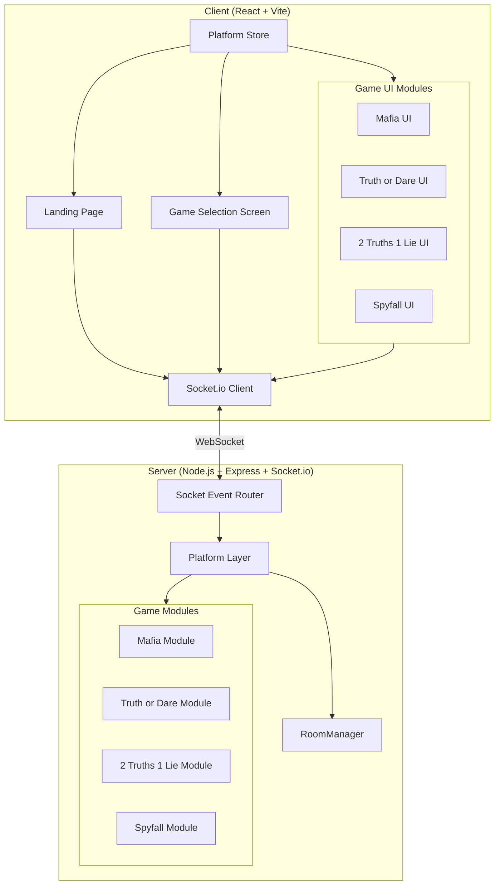
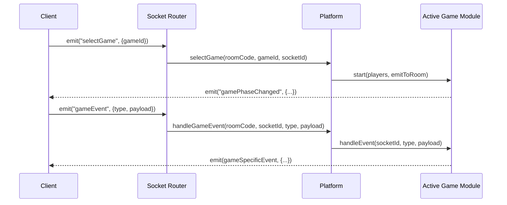
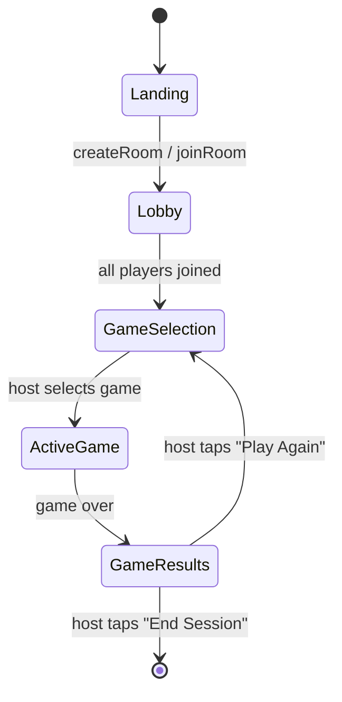

# Design Document: Party Games Platform

## Overview

This design transforms the existing Mafia social deduction game into a multi-game party platform. The core architectural change is extracting game-agnostic room/lobby infrastructure from the current codebase into a **Platform Layer**, then defining a **Game_Module interface** that each game implements. The existing Mafia game becomes the first Game_Module, and three new games (Truth or Dare, 2 Truths 1 Lie, Spyfall) are added as additional modules.

The system retains its real-time, in-memory, WebSocket-based architecture. No database is introduced. The server remains a single Node.js process with Socket.io handling all client communication.

### Key Design Decisions

1. **Extract, don't rewrite**: The current RoomManager already handles room creation, room codes, player joining, host transfer, and name validation. This becomes the Platform's core with minimal changes.
2. **Game_Module as a class interface**: Each game implements a TypeScript interface with lifecycle hooks (`start`, `handleEvent`, `getState`, `end`). The Platform routes socket events to the active game module.
3. **Directory-based module organization**: `server/src/games/{game-name}/` and `client/src/games/{game-name}/` keep each game self-contained.
4. **Shared Platform state, game-specific state**: The Platform owns Room/Player state. Each Game_Module owns its own game state internally, returned via `getState()` for reconnection.
5. **Phase enum per game**: Each game defines its own phases (enum), separate from the platform-level phases (Lobby, GameSelection, GameOver).

---

## Architecture

### High-Level System Diagram



### Event Routing Architecture



### Platform Phase Flow



---

## Components and Interfaces

### Server Components

#### 1. Platform Layer (`server/src/Platform.ts`)

The orchestrator that replaces the current `GameManager`. Manages room lifecycle and delegates game logic to modules.

```typescript
import { Server, Socket } from "socket.io";
import { RoomManager } from "./RoomManager.js";
import { GameModule, GameModuleConfig } from "./types.js";

export class Platform {
  private roomManager: RoomManager;
  private gameRegistry: Map<string, () => GameModule>; // gameId -> factory
  private activeGames: Map<string, GameModule>;        // roomCode -> active module
  private playerRoomIndex: Map<string, string>;        // socketId -> roomCode
  private disconnectTimers: Map<string, NodeJS.Timeout>;
  private io: Server;

  constructor(io: Server, roomManager?: RoomManager);

  /** Register a game module factory */
  registerGame(gameId: string, factory: () => GameModule, config: GameModuleConfig): void;

  /** Get all registered game configs (for Game Selection Screen) */
  getAvailableGames(): Array<{ id: string; config: GameModuleConfig }>;

  /** Create a new room, return room code */
  createRoom(playerName: string, socketId: string): { roomCode: string; hostId: string };

  /** Join existing room */
  joinRoom(roomCode: string, playerName: string, socketId: string): void;

  /** Host selects a game to play */
  selectGame(roomCode: string, gameId: string, requesterId: string): void;

  /** Route a game-specific event to the active module */
  handleGameEvent(roomCode: string, socketId: string, eventType: string, payload: unknown): void;

  /** Handle player disconnect */
  handleDisconnect(socketId: string): void;

  /** Handle player reconnect */
  handleReconnect(roomCode: string, playerName: string, socketId: string): void;

  /** Host triggers return to game selection */
  returnToGameSelection(roomCode: string, requesterId: string): void;

  /** Host ends the session entirely */
  endSession(roomCode: string, requesterId: string): void;
}
```

#### 2. Game Module Interface (`server/src/types.ts`)

```typescript
export interface GameModuleConfig {
  id: string;
  name: string;
  minPlayers: number;
  maxPlayers: number;
  description: string;
}

export interface GameModuleContext {
  /** Emit event to all players in the room */
  emitToRoom: (event: string, payload: unknown) => void;
  /** Emit event to a specific player */
  emitToPlayer: (socketId: string, event: string, payload: unknown) => void;
  /** Signal that the game is over, with results payload */
  signalGameOver: (results: unknown) => void;
  /** Get current player list (id, name, isConnected) */
  getPlayers: () => Array<{ id: string; name: string; isConnected: boolean }>;
}

export interface GameModule {
  readonly config: GameModuleConfig;

  /** Initialize the game with connected players */
  start(context: GameModuleContext): void;

  /** Handle a game-specific socket event from a player */
  handleEvent(socketId: string, eventType: string, payload: unknown): void;

  /** Return current game state for a reconnecting player */
  getState(socketId: string): unknown;

  /** Handle a player disconnecting mid-game */
  handleDisconnect(socketId: string): void;

  /** Clean up timers and state when game ends */
  end(): void;
}
```

#### 3. RoomManager (`server/src/RoomManager.ts`) — Minimal Changes

The existing RoomManager stays largely unchanged. Changes:
- Remove the Mafia-specific `GamePhase` from room tracking; replace with a generic `PlatformPhase` enum.
- The `Room` type gets a `platformPhase` field instead of `phase`.
- Remove `gameState` from Room (game state lives in the GameModule instance).

#### 4. Game Module Implementations

Each game lives in its own directory:

| Module | Server Path | Client Path |
|--------|-------------|-------------|
| Mafia | `server/src/games/mafia/` | `client/src/games/mafia/` |
| Truth or Dare | `server/src/games/truth-or-dare/` | `client/src/games/truth-or-dare/` |
| 2 Truths 1 Lie | `server/src/games/two-truths-one-lie/` | `client/src/games/two-truths-one-lie/` |
| Spyfall | `server/src/games/spyfall/` | `client/src/games/spyfall/` |

##### Mafia Module (`server/src/games/mafia/MafiaModule.ts`)

Wraps the existing `PhaseController` and `VoteManager` logic behind the `GameModule` interface. The existing game logic (role assignment, night actions, voting, win conditions) is preserved without rule changes.

```typescript
export class MafiaModule implements GameModule {
  readonly config: GameModuleConfig = {
    id: "mafia",
    name: "Mafia",
    minPlayers: 4,
    maxPlayers: 10,
    description: "A social deduction game of deception and survival.",
  };

  private context!: GameModuleContext;
  private phaseController: PhaseController;
  private voteManager: VoteManager;
  private gameState: MafiaGameState;

  start(context: GameModuleContext): void;
  handleEvent(socketId: string, eventType: string, payload: unknown): void;
  getState(socketId: string): MafiaClientState;
  handleDisconnect(socketId: string): void;
  end(): void;
}
```

##### Truth or Dare Module (`server/src/games/truth-or-dare/TruthOrDareModule.ts`)

```typescript
export class TruthOrDareModule implements GameModule {
  readonly config: GameModuleConfig = {
    id: "truth-or-dare",
    name: "Truth or Dare",
    minPlayers: 2,
    maxPlayers: 10,
    description: "Submit prompts, spin the wheel, answer truths or complete dares.",
  };

  private context!: GameModuleContext;
  private phase: "submission" | "play";
  private promptPool: Array<{ text: string; category: "truth" | "dare"; submittedBy: string }>;
  private readyPlayers: Set<string>;
  private playerSubmissionCounts: Map<string, number>;
  private currentSelectedPlayer: string | null;
  private hostId: string;

  start(context: GameModuleContext): void;
  handleEvent(socketId: string, eventType: string, payload: unknown): void;
  getState(socketId: string): TruthOrDareClientState;
  handleDisconnect(socketId: string): void;
  end(): void;
}
```

##### 2 Truths 1 Lie Module (`server/src/games/two-truths-one-lie/TwoTruthsOneLieModule.ts`)

```typescript
export class TwoTruthsOneLieModule implements GameModule {
  readonly config: GameModuleConfig = {
    id: "two-truths-one-lie",
    name: "2 Truths 1 Lie",
    minPlayers: 3,
    maxPlayers: 10,
    description: "Submit 2 truths and 1 lie. Others guess which is the lie.",
  };

  private context!: GameModuleContext;
  private phase: "submission" | "play" | "reveal";
  private statementSets: Map<string, StatementSet>; // playerId -> statements
  private presentationOrder: string[];              // shuffled player IDs
  private currentIndex: number;
  private votes: Map<string, number>;               // playerId -> voted statement index
  private scores: Map<string, number>;              // playerId -> score
  private voteTimer: NodeJS.Timeout | null;

  start(context: GameModuleContext): void;
  handleEvent(socketId: string, eventType: string, payload: unknown): void;
  getState(socketId: string): TwoTruthsOneLieClientState;
  handleDisconnect(socketId: string): void;
  end(): void;
}
```

##### Spyfall Module (`server/src/games/spyfall/SpyfallModule.ts`)

```typescript
export class SpyfallModule implements GameModule {
  readonly config: GameModuleConfig = {
    id: "spyfall",
    name: "Spyfall",
    minPlayers: 4,
    maxPlayers: 10,
    description: "One player is the spy. Deduce the location — or bluff your way through.",
  };

  private context!: GameModuleContext;
  private phase: "question" | "voting";
  private spyId: string;
  private location: string;
  private locations: string[];                      // full list of 20+ locations
  private turnOrder: string[];                      // player IDs in question order
  private currentQuestionerIndex: number;
  private currentTarget: string | null;
  private roundTimer: NodeJS.Timeout | null;
  private voteTimer: NodeJS.Timeout | null;
  private votes: Map<string, string>;               // voterId -> accusedId
  private roundDuration: number;                    // default 480000ms

  start(context: GameModuleContext): void;
  handleEvent(socketId: string, eventType: string, payload: unknown): void;
  getState(socketId: string): SpyfallClientState;
  handleDisconnect(socketId: string): void;
  end(): void;
}
```

### Client Components

#### Platform-Level Components

| Component | File | Purpose |
|-----------|------|---------|
| `App` | `client/src/App.tsx` | Root router — renders based on platform phase |
| `LandingPage` | `client/src/pages/LandingPage.tsx` | Create/join room |
| `GameSelectionScreen` | `client/src/pages/GameSelectionScreen.tsx` | Host picks game |
| `GameResultsScreen` | `client/src/pages/GameResultsScreen.tsx` | Shows results, Play Again / End Session |
| `PlatformStore` | `client/src/store/platformStore.ts` | Global state (room, players, phase) |
| `socket` | `client/src/socket.ts` | Socket.io client instance (unchanged) |

#### Game-Specific UI Components

Each game registers its own React component tree:

```typescript
// client/src/games/registry.ts
export interface GameUIModule {
  id: string;
  component: React.ComponentType<GameUIProps>;
  icon?: string;
}

export interface GameUIProps {
  roomCode: string;
  players: PlatformPlayer[];
  myPlayerId: string;
  isHost: boolean;
}
```

Games export their root component:
- `client/src/games/mafia/MafiaGame.tsx`
- `client/src/games/truth-or-dare/TruthOrDareGame.tsx`
- `client/src/games/two-truths-one-lie/TwoTruthsOneLieGame.tsx`
- `client/src/games/spyfall/SpyfallGame.tsx`

---

## Data Models

### Platform-Level Types (`server/src/types.ts`)

```typescript
/** Platform-level phases (not game-specific) */
export enum PlatformPhase {
  Lobby = "Lobby",
  GameSelection = "GameSelection",
  ActiveGame = "ActiveGame",
  GameResults = "GameResults",
}

/** Platform-level player (game-agnostic) */
export interface PlatformPlayer {
  id: string;               // Socket ID
  name: string;             // 1-32 chars (host), 1-20 chars (join)
  isHost: boolean;
  isConnected: boolean;
  disconnectedAt: Date | null;
  color: string;
}

/** Platform-level room */
export interface PlatformRoom {
  roomCode: string;         // 6-char uppercase alphanumeric
  hostId: string;           // Socket ID of host
  players: Map<string, PlatformPlayer>;
  platformPhase: PlatformPhase;
  activeGameId: string | null;
  createdAt: Date;
}

/** Game module interface config */
export interface GameModuleConfig {
  id: string;
  name: string;
  minPlayers: number;
  maxPlayers: number;
  description: string;
}

/** Context passed to game modules */
export interface GameModuleContext {
  emitToRoom: (event: string, payload: unknown) => void;
  emitToPlayer: (socketId: string, event: string, payload: unknown) => void;
  signalGameOver: (results: unknown) => void;
  getPlayers: () => Array<{ id: string; name: string; isConnected: boolean }>;
}

export interface GameModule {
  readonly config: GameModuleConfig;
  start(context: GameModuleContext): void;
  handleEvent(socketId: string, eventType: string, payload: unknown): void;
  getState(socketId: string): unknown;
  handleDisconnect(socketId: string): void;
  end(): void;
}
```

### Truth or Dare Types (`server/src/games/truth-or-dare/types.ts`)

```typescript
export interface Prompt {
  id: string;
  text: string;              // 1-280 chars
  category: "truth" | "dare";
  submittedBy: string;       // player ID
}

export interface TruthOrDareState {
  phase: "submission" | "play";
  promptPool: Prompt[];
  readyPlayers: string[];    // player IDs
  currentSelectedPlayer: string | null;
  currentPrompt: Prompt | null;
  currentCategory: "truth" | "dare" | null;
  hostId: string;
}
```

### 2 Truths 1 Lie Types (`server/src/games/two-truths-one-lie/types.ts`)

```typescript
export interface Statement {
  text: string;              // 1-200 chars
  isLie: boolean;
}

export interface StatementSet {
  playerId: string;
  playerName: string;
  statements: Statement[];   // exactly 3
}

export interface TwoTruthsOneLieState {
  phase: "submission" | "play" | "reveal" | "scores";
  currentPresenter: string | null;
  currentStatements: string[] | null;   // shuffled text only (no isLie)
  votes: Record<string, number>;        // playerId -> statement index voted
  scores: Record<string, number>;       // playerId -> total score
  roundNumber: number;
  totalRounds: number;
  voteTimeRemaining: number;
}
```

### Spyfall Types (`server/src/games/spyfall/types.ts`)

```typescript
export interface SpyfallState {
  phase: "question" | "voting";
  isSpy: boolean;                       // true for the spy's getState()
  location: string | null;              // null for spy, actual location for others
  allLocations: string[];               // always shown to all (spy reference)
  currentQuestioner: string;
  currentTarget: string | null;
  timeRemaining: number;                // seconds
  turnOrder: string[];
}

export const SPYFALL_LOCATIONS: string[] = [
  "Airport", "Bank", "Beach", "Casino", "Cathedral",
  "Circus", "Corporate Office", "Cruise Ship", "Day Spa", "Embassy",
  "Hospital", "Hotel", "Military Base", "Movie Studio", "Museum",
  "Ocean Liner", "Passenger Train", "Pirate Ship", "Police Station", "Restaurant",
  "School", "Space Station", "Submarine", "Supermarket", "University",
];
```

### Client Platform Store Types (`client/src/store/types.ts`)

```typescript
export interface PlatformStore {
  // Connection
  isConnected: boolean;
  disconnectedAt: number | null;

  // Room
  roomCode: string | null;
  platformPhase: PlatformPhase | null;
  players: PlatformPlayer[];
  myPlayer: PlatformPlayer | null;

  // Game selection
  availableGames: GameModuleConfig[];
  activeGameId: string | null;

  // Game results (from last completed game)
  gameResults: unknown | null;

  // Errors
  error: string | null;
}
```

---


## Correctness Properties

*A property is a characteristic or behavior that should hold true across all valid executions of a system — essentially, a formal statement about what the system should do. Properties serve as the bridge between human-readable specifications and machine-verifiable correctness guarantees.*

### Property 1: Room creation produces valid room for valid host names

*For any* string of length 1–32 characters used as a host name, calling `createRoom` SHALL succeed and return a Room with a 6-character uppercase alphanumeric room code, and the creating player SHALL be designated as host.

**Validates: Requirements 1.2**

### Property 2: Room joining succeeds for valid player names

*For any* existing room in Lobby phase with fewer than 10 players, and any player name of 1–20 characters not already in use in that room, calling `joinRoom` SHALL succeed and the player SHALL appear in the room's player list.

**Validates: Requirements 1.3**

### Property 3: Duplicate name rejection

*For any* room with existing connected players, attempting to join with a name identical to an already-connected player's name SHALL be rejected with an error message.

**Validates: Requirements 1.7**

### Property 4: Host-only action authorization

*For any* room and any non-host player, attempting to perform host-only actions (selectGame, spinWheel, nextTurn, endGame, playAgain, endSession) SHALL be rejected with an "insufficient permissions" error message.

**Validates: Requirements 2.5, 6.9, 7.4, 15.4**

### Property 5: Valid game selection loads module

*For any* registered game ID selected by the host while the room is in GameSelection phase with sufficient players, the server SHALL load the corresponding Game_Module, transition to ActiveGame, and emit a `gameSelected` event to all players.

**Validates: Requirements 2.4**

### Property 6: Unrecognized game ID rejection

*For any* string that is not a registered game module ID, a `selectGame` event SHALL be rejected with an error indicating the game is not available.

**Validates: Requirements 2.6**

### Property 7: Player count enforcement per game

*For any* room with N players and any game requiring minPlayers > N or maxPlayers < N, attempting to start that game SHALL be rejected, and the Game Selection Screen SHALL display that game as unavailable.

**Validates: Requirements 2.8, 3.6**

### Property 8: Game over returns to GameSelection preserving players

*For any* game module that signals game over, the Platform SHALL transition the room back to GameSelection phase, retaining all currently connected players in the room.

**Validates: Requirements 3.3, 15.2**

### Property 9: Game event routing to active module

*For any* game-specific event emitted while a Game_Module is active, the Platform SHALL route that event to the active module's `handleEvent` method with the correct socketId and payload.

**Validates: Requirements 3.4**

### Property 10: Prompt text validation (Truth or Dare)

*For any* string of length 1–280 characters labeled "truth" or "dare", submitting it as a prompt SHALL succeed. For any string of length 0 or exceeding 280 characters, submission SHALL be rejected with an error.

**Validates: Requirements 5.3, 5.4**

### Property 11: Ready requires minimum one submission

*For any* player in the Truth or Dare submission phase, attempting to set ready status SHALL succeed only if that player has submitted at least 1 prompt. With 0 submissions, ready SHALL be rejected.

**Validates: Requirements 5.5**

### Property 12: All-ready transition to play phase

*For any* room in a submission phase (Truth or Dare or 2 Truths 1 Lie) where all players have met the ready criteria, the game SHALL automatically transition to the Play phase.

**Validates: Requirements 5.7, 8.6**

### Property 13: Wheel spin selects valid player

*For any* room with N players in the Truth or Dare play phase, spinning the wheel SHALL select exactly one player from the room's player list.

**Validates: Requirements 6.2**

### Property 14: Prompt category matching

*For any* prompt pool containing prompts of a requested category, selecting that category SHALL return a prompt matching the requested category. If the pool contains no prompts of the requested category, the server SHALL fall back to the other category.

**Validates: Requirements 6.5, 6.6**

### Property 15: Statement set validation (2 Truths 1 Lie)

*For any* submission of exactly 3 statements each between 1–200 characters with exactly 1 marked as the lie, the server SHALL accept the statement set. For any submission that does not meet these constraints (wrong count, wrong length, wrong lie count), the server SHALL reject it.

**Validates: Requirements 8.2, 8.3, 8.4**

### Property 16: Lie concealment until reveal

*For any* player viewing another player's presented statements during the voting phase, the game state returned by `getState` SHALL NOT include which statement is the lie.

**Validates: Requirements 8.7**

### Property 17: Statement presentation order differs from submission

*For any* player's statement set when presented during the play phase, the order of statements SHALL differ from the original submission order (shuffled).

**Validates: Requirements 9.1**

### Property 18: Single vote per player per round

*For any* player who has already submitted a vote in the current round, attempting to submit a second vote SHALL be rejected with a duplicate vote error.

**Validates: Requirements 9.4**

### Property 19: Correct lie identification scores +1 point

*For any* player who correctly identifies the lie in a 2 Truths 1 Lie round, that player's score SHALL increase by exactly 1 point. Players who voted incorrectly SHALL have no score change.

**Validates: Requirements 9.6, 10.2**

### Property 20: Final scoreboard sorted descending

*For any* completed 2 Truths 1 Lie game, the final scoreboard SHALL list all players sorted by score in descending order.

**Validates: Requirements 9.8, 10.4**

### Property 21: Spyfall role assignment and information hiding

*For any* Spyfall game with N players (4–10), the server SHALL assign exactly 1 player as the Spy. All non-Spy players SHALL receive the selected location. The Spy SHALL NOT receive the location but SHALL receive the full list of all possible locations.

**Validates: Requirements 11.1, 11.2, 11.3, 11.6**

### Property 22: Spyfall turn order fairness

*For any* set of N players over K question turns, each player SHALL serve as questioner either ⌊K/N⌋ or ⌈K/N⌉ times (equal distribution before anyone gets an extra turn).

**Validates: Requirements 12.4, 12.5**

### Property 23: Spyfall vote tally outcome

*For any* set of votes in Spyfall: if one player has a strict majority, that player is accused. If the accused player is the Spy, outcome is "Players Win". If the accused is not the Spy, outcome is "Spy Wins". If there is a tie, outcome is "Spy Wins".

**Validates: Requirements 13.6, 13.7, 13.8, 13.9**

### Property 24: Spy guess outcome

*For any* Spyfall game, if the Spy guesses the correct location, outcome SHALL be "Spy Wins". If the Spy guesses incorrectly, outcome SHALL be "Players Win".

**Validates: Requirements 14.4, 14.5**

### Property 25: Disconnect/reconnect round-trip preserves state

*For any* player who disconnects and reconnects within 60 seconds using the same room code and player name, the Platform SHALL restore that player's state (including game state via `getState`) identically to before disconnection.

**Validates: Requirements 16.3, 16.4**

### Property 26: Disconnected player abstains from voting

*For any* player who is disconnected when a voting phase concludes (timer expires), that player SHALL be counted as abstaining and their non-vote SHALL NOT affect the tally outcome.

**Validates: Requirements 19.3**

### Property 27: Host disconnect transfers host during active game

*For any* room where the host disconnects during an active game, the Platform SHALL transfer host status to the next connected player and emit a `roomUpdated` event.

**Validates: Requirements 19.5, 3.5**

### Property 28: Timer display format

*For any* integer value of remaining seconds between 0 and 999, the timer display SHALL format as MM:SS where MM is zero-padded minutes and SS is zero-padded seconds.

**Validates: Requirements 13.3**

---

## Error Handling

### Platform-Level Errors

| Error Condition | Response | Recovery |
|-----------------|----------|----------|
| Invalid player name (empty or too long) | Reject with descriptive error via callback | Client shows inline validation message |
| Room not found | Reject with "Room not found" | Client returns to Landing Page |
| Room full (10 players) | Reject with "Room is full" | Client shows error, stays on join form |
| Duplicate name | Reject with "Name already taken" | Client prompts new name |
| Non-host attempts host action | Reject with "Insufficient permissions" | Client ignores (button shouldn't be visible) |
| Invalid game ID | Reject with "Game not available" | Client stays on Game Selection |
| Insufficient players for game | Reject with "Need N players minimum" | Game shown as unavailable |
| Player disconnects | 60s retention timer starts | Auto-rejoin on reconnect |
| Player removed after 60s | Remove from room, notify others | Game handles gracefully |
| Server restart | All state lost | Clients detect disconnect, return to Landing |

### Game-Level Errors

Each Game_Module handles its own validation errors via the `GameModuleContext.emitToPlayer` method. The Platform catches any uncaught exceptions from game modules and:
1. Logs the error server-side
2. Emits a generic "game error" event to the affected player
3. Does NOT crash the server or affect other rooms

### Socket Error Pattern

All socket event handlers follow the existing try/catch pattern with callbacks:

```typescript
socket.on("eventName", (payload, callback) => {
  try {
    // ... logic
    if (typeof callback === "function") callback({ success: true, ...data });
  } catch (err: any) {
    const message = err?.message ?? "Operation failed.";
    socket.emit("error", { success: false, error: message });
    if (typeof callback === "function") callback({ success: false, error: message });
  }
});
```

---

## Testing Strategy

### Dual Testing Approach

This feature uses both example-based unit tests and property-based tests for comprehensive coverage.

### Property-Based Testing

**Library**: `fast-check` (already in devDependencies for both server and client)
**Runner**: `vitest` (already configured)
**Minimum iterations**: 100 per property test

Each property test MUST:
- Run at minimum 100 iterations (`fc.assert(property, { numRuns: 100 })`)
- Reference its design document property in a tag comment
- Use `fast-check` arbitraries to generate valid and invalid inputs

**Tag format**: `// Feature: party-games-platform, Property {N}: {title}`

### Unit Tests (Example-Based)

Unit tests cover:
- Specific UI rendering scenarios (landing page, game selection, wheel display)
- Integration points (Socket.io event emission, module loading)
- Edge cases caught by property test generators (empty pool fallback, timer expiry)
- Configuration verification (min/max players, location count)

### Test Organization

```
server/src/
├── Platform.test.ts                    # Platform layer tests
├── games/
│   ├── mafia/MafiaModule.test.ts       # Mafia module tests
│   ├── truth-or-dare/TruthOrDareModule.test.ts
│   ├── two-truths-one-lie/TwoTruthsOneLieModule.test.ts
│   └── spyfall/SpyfallModule.test.ts
client/src/
├── pages/LandingPage.test.tsx
├── pages/GameSelectionScreen.test.tsx
├── games/
│   ├── mafia/MafiaGame.test.tsx
│   ├── truth-or-dare/TruthOrDareGame.test.tsx
│   ├── two-truths-one-lie/TwoTruthsOneLieGame.test.tsx
│   └── spyfall/SpyfallGame.test.tsx
```

### Key Test Scenarios

| Scenario | Type | Property Reference |
|----------|------|-------------------|
| Create room with random valid names | Property | P1 |
| Join room with random valid names | Property | P2 |
| Non-host action rejection across all actions | Property | P4 |
| Prompt validation across random inputs | Property | P10 |
| Statement set validation | Property | P15 |
| Spyfall role/info assignment | Property | P21 |
| Spyfall vote outcomes | Property | P23 |
| Disconnect/reconnect round-trip | Property | P25 |
| Game selection with 4 games visible | Example | Req 2.2 |
| Mafia module wraps existing logic | Integration | Req 4.1 |
| Timer formats correctly | Property | P28 |
