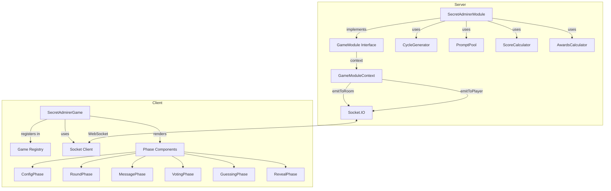
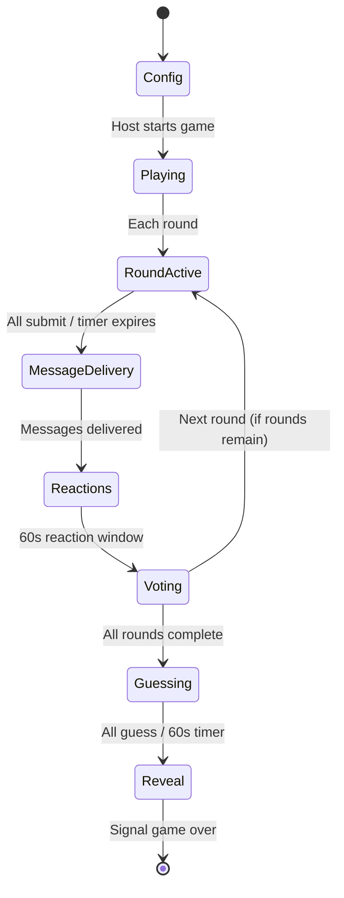

# Design Document: Secret Admirer

## Overview

Secret Admirer is a party game module for the web-based party games platform. Players are secretly assigned into a Hamiltonian cycle where each player admires exactly one other player. Over multiple configurable rounds, players anonymously answer prompts about their assigned person. The game concludes with a guessing phase, a dramatic reveal, scoring, and fun awards.

The module integrates with the existing platform via the `GameModule` interface, using Socket.IO for real-time communication and following the same patterns established by existing games (battle-shits, two-truths-one-lie, spyfall, etc.).

## Architecture



### Game Phases



## Components and Interfaces

### Server-Side Components

#### SecretAdmirerModule (GameModule implementation)

The primary module class implementing the `GameModule` interface:

```typescript
interface GameModule {
  readonly config: GameModuleConfig;
  start(context: GameModuleContext): void;
  handleEvent(socketId: string, eventType: string, payload: unknown): void;
  getState(socketId: string): unknown;
  handleDisconnect(socketId: string): void;
  handlePlayerRemoval?(socketId: string): void;
  end(): void;
}
```

**Config:**
```typescript
{
  id: "secret-admirer",
  name: "Secret Admirer",
  minPlayers: 3,
  maxPlayers: 20,
  description: "Get secretly assigned someone to admire. Answer prompts anonymously, then guess who your admirer was! 💌"
}
```

**Events handled:**
- `configure` — Host sets game options (rounds, spice level, timer, custom prompts)
- `startGame` — Host starts the game
- `submitCustomPrompt` — Player submits a custom prompt for the current round
- `submitAnswer` — Player submits their anonymous answer
- `react` — Player reacts to a message with an emoji
- `submitVote` — Player votes for funniest message
- `submitGuess` — Player guesses their admirer
- `getState` — Returns personalized game state

#### CycleGenerator

A pure function responsible for generating the Admirer_Cycle:

```typescript
function generateAdmirerCycle(playerIds: string[]): Map<string, string>;
// Returns a map where key = admirer, value = target (the person they admire)
```

**Algorithm:** Fisher-Yates shuffle of player array, then create cycle by assigning each player to the next player in the shuffled array (last player assigned to first). This guarantees a single Hamiltonian cycle with no sub-cycles.

#### PromptPool

Loads and manages prompts from a JSON file:

```typescript
class PromptPool {
  constructor(filePath: string);
  validate(): ValidationResult;
  getPrompt(spiceLevel: SpiceLevel, usedPrompts: Set<string>): string | null;
  getFallbackPrompt(currentLevel: SpiceLevel, usedPrompts: Set<string>): string | null;
}
```

#### ScoreCalculator

Pure functions for scoring:

```typescript
function calculateRoundScores(votes: Map<string, string>, reactions: Map<string, ReactionData>): ScoreUpdate[];
function calculateGuessScores(guesses: Map<string, string>, cycle: Map<string, string>): ScoreUpdate[];
function buildLeaderboard(scores: Map<string, number>, playerNames: Map<string, string>): LeaderboardEntry[];
```

#### AwardsCalculator

Pure functions for end-of-game awards:

```typescript
function calculateAwards(gameData: GameData): Award[];
```

### Client-Side Components

#### SecretAdmirerGame (React Component)

Main game component registered in the client game registry:

```typescript
// In registry.tsx
{ id: "secret-admirer", component: SecretAdmirerGame, icon: "💌" }
```

Phase sub-components:
- `ConfigPhase` — Host configuration UI
- `RoundPhase` — Prompt display + answer input
- `MessagePhase` — Received message display + reactions
- `VotingPhase` — Community voting UI
- `GuessingPhase` — Admirer guess selection
- `RevealPhase` — Full reveal with assignments, messages, scores, and awards

### Socket Events (Server → Client)

| Event | Payload | When |
|-------|---------|------|
| `saPhaseChanged` | `{ phase, config? }` | Phase transitions |
| `saAssignment` | `{ targetId, targetName }` | Game start (per-player) |
| `saRoundStarted` | `{ roundNumber, totalRounds, prompt, timeRemaining }` | Each round |
| `saAnswerReceived` | `{ playerId, submittedCount, totalPlayers }` | Answer submitted |
| `saMessageDelivered` | `{ message, roundNumber }` | Message delivered to target |
| `saReactionUpdated` | `{ messageId, reactions }` | Reaction added |
| `saVotingStarted` | `{ messages[], timeRemaining }` | Voting phase begins |
| `saVoteReceived` | `{ votesIn, totalEligible }` | Vote cast |
| `saRoundResults` | `{ winningMessageId, scores }` | Voting ends |
| `saGuessingStarted` | `{ players[], timeRemaining }` | Guessing phase |
| `saRevealData` | `{ cycle, guesses, messages, stats, scores, awards }` | Reveal phase |

### Socket Events (Client → Server via `gameEvent`)

| Event Type | Payload | Description |
|------------|---------|-------------|
| `configure` | `{ rounds?, spiceLevel?, customPrompts?, roundTimer? }` | Host config |
| `startGame` | `{}` | Host starts |
| `submitCustomPrompt` | `{ prompt }` | Submit custom prompt |
| `submitAnswer` | `{ text }` | Submit round answer |
| `react` | `{ messageId, emoji }` | React to message |
| `submitVote` | `{ messageId }` | Vote for funniest |
| `submitGuess` | `{ playerId }` | Guess admirer |
| `getState` | `{}` | Request current state |

## Data Models

### Server State

```typescript
type SpiceLevel = "mild" | "medium" | "hot";

interface SecretAdmirerConfig {
  rounds: number;           // 5-20, default 10
  spiceLevel: SpiceLevel;   // default "mild"
  customPrompts: boolean;   // default false
  roundTimer: number;       // 30-120 seconds, step 5, default 60
}

type GamePhase =
  | "config"
  | "roundActive"
  | "messageDelivery"
  | "reactions"
  | "voting"
  | "guessing"
  | "reveal";

interface RoundMessage {
  authorId: string;
  targetId: string;
  text: string;
  submittedAt: number;  // timestamp (ms from round start)
  reactions: Map<string, Set<string>>; // emoji → set of reactor playerIds
}

interface SecretAdmirerState {
  phase: GamePhase;
  config: SecretAdmirerConfig;
  cycle: Map<string, string>;          // admirer → target
  currentRound: number;
  totalRounds: number;
  usedPrompts: Set<string>;
  currentPrompt: string | null;
  customPromptQueue: Map<string, string>; // playerId → prompt text
  roundMessages: Map<number, RoundMessage[]>; // round → messages
  currentRoundAnswers: Map<string, string>;   // playerId → answer text
  votes: Map<number, Map<string, string>>;    // round → (voterId → messageAuthorId)
  guesses: Map<string, string>;               // playerId → guessedAdmirerId
  scores: Map<string, number>;                // playerId → cumulative score
  roundStartTime: number | null;
  roundTimer: ReturnType<typeof setTimeout> | null;
  reactionTimer: ReturnType<typeof setTimeout> | null;
  votingTimer: ReturnType<typeof setTimeout> | null;
  guessingTimer: ReturnType<typeof setTimeout> | null;
}
```

### Client State (returned by getState)

```typescript
interface SecretAdmirerClientState {
  phase: GamePhase;
  config: SecretAdmirerConfig;
  myTargetName: string | null;         // only after game starts
  currentRound: number;
  totalRounds: number;
  currentPrompt: string | null;
  timeRemaining: number;
  hasSubmittedAnswer: boolean;
  submittedCount: number;
  totalPlayers: number;

  // Messages I've received (anonymous)
  myMessages: Array<{
    id: string;
    roundNumber: number;
    text: string;
    reactions: Record<string, number>;  // emoji → count
    myReactions: string[];              // emojis I've used
  }>;

  // Voting phase
  votingMessages: Array<{ id: string; text: string }> | null;
  hasVoted: boolean;

  // Guessing phase
  guessOptions: Array<{ id: string; name: string }> | null;
  hasGuessed: boolean;

  // Scores
  scores: Record<string, number>;

  // Reveal (only during reveal phase)
  revealData: RevealData | null;
}
```

### Prompt File Format

```json
{
  "mild": [
    "What's something you admire about {target}?",
    "If {target} were a superhero, their power would be...",
    ...
  ],
  "medium": [...],
  "hot": [...]
}
```

File location: `server/src/games/secret-admirer/prompts.json`

## Correctness Properties

*A property is a characteristic or behavior that should hold true across all valid executions of a system — essentially, a formal statement about what the system should do. Properties serve as the bridge between human-readable specifications and machine-verifiable correctness guarantees.*

### Property 1: Admirer Cycle structural invariants

*For any* set of 3 to 20 unique player identifiers, the generated Admirer_Cycle SHALL have exactly N assignments (where N is the number of players), every player appears exactly once as a source (admirer), every player appears exactly once as a target (admired), no player is assigned to themselves, and following the assignments from any player eventually visits all players exactly once before returning to the start (single cycle, no sub-cycles).

**Validates: Requirements 3.1, 3.2, 3.3, 14.2**

### Property 2: Admirer Cycle serialization round-trip

*For any* set of 3 to 20 unique player identifiers, generating an Admirer_Cycle, serializing it to an assignment map (admirer → target), and reconstructing the cycle from that map SHALL produce an equivalent cycle (same set of admirer→target pairs).

**Validates: Requirements 14.1**

### Property 3: Admirer Cycle randomness

*For any* set of 3 to 20 unique player identifiers, generating 10 Admirer_Cycles with distinct random seeds SHALL produce at least 2 distinct permutations (cycles that differ in at least one assignment).

**Validates: Requirements 14.3**

### Property 4: Rounds configuration validation

*For any* integer value, setting it as the number of rounds SHALL be accepted if and only if it is a whole number between 5 and 20 inclusive. Values outside this range SHALL be rejected and the previous valid value retained.

**Validates: Requirements 2.2, 2.3**

### Property 5: Round timer configuration validation

*For any* integer value, setting it as the round timer duration SHALL be accepted if and only if it is between 30 and 120 inclusive and is a multiple of 5. Invalid values SHALL be rejected.

**Validates: Requirements 2.7**

### Property 6: Non-host configuration rejection

*For any* non-host player and any configuration change payload, the system SHALL reject the change and preserve the current configuration values unchanged.

**Validates: Requirements 2.8**

### Property 7: Information hiding before reveal

*For any* player and any game phase prior to the Reveal_Phase, calling getState SHALL NOT expose: any other player's assignment (who they admire or who admires them), the authorship of any anonymous message, or any other player's guess during the guessing phase.

**Validates: Requirements 3.5, 5.6, 8.8**

### Property 8: Prompt non-repetition and consistency

*For any* game with N rounds (5-20), all selected prompts across all rounds SHALL be distinct (no prompt appears more than once), and within a single round, all players SHALL receive the same prompt text.

**Validates: Requirements 4.2, 4.3**

### Property 9: Custom prompt length validation

*For any* string submitted as a custom prompt when custom prompts are enabled, the system SHALL accept it if and only if its character length is between 1 and 300 inclusive. Strings of length 0 or greater than 300 SHALL be rejected.

**Validates: Requirements 4.7**

### Property 10: Answer length validation

*For any* string submitted as a round answer, the system SHALL accept it if and only if its character length is between 1 and 500 inclusive. Empty strings or strings exceeding 500 characters SHALL be rejected with an error indicating the length constraint.

**Validates: Requirements 5.2, 5.3**

### Property 11: Duplicate answer rejection (idempotence)

*For any* player who has already submitted a valid answer in the current round, submitting a second answer SHALL be rejected and the original answer SHALL remain unchanged.

**Validates: Requirements 5.4**

### Property 12: Round completion on all submissions

*For any* set of connected players in a round, when all connected players have submitted valid answers, the round SHALL end immediately (without waiting for the timer to expire).

**Validates: Requirements 5.7**

### Property 13: Anonymous message delivery

*For any* valid answer submitted by a player about their target, after the round ends the target SHALL receive the message in the format "💌 Anonymous admirer says... [message]" with no identifying information about the author.

**Validates: Requirements 5.8**

### Property 14: Reaction emoji validation

*For any* emoji submitted as a reaction, the system SHALL accept it if and only if it is one of the predefined set (❤️, 😂, 😍, 🔥, 👀, 💀). Additionally, submitting the same emoji to the same message a second time SHALL be rejected, and attempting to react to a message not addressed to the player SHALL be rejected.

**Validates: Requirements 6.1, 6.3, 6.4, 6.5**

### Property 15: Reaction count anonymity

*For any* reaction submission, the emitted reaction update SHALL contain aggregate counts per emoji but SHALL NOT include any player identifier indicating who reacted.

**Validates: Requirements 6.2**

### Property 16: Voting constraints

*For any* player during the community voting phase, the system SHALL allow exactly one vote, and SHALL reject any vote cast for the player's own message. Self-voting SHALL be rejected with an appropriate error.

**Validates: Requirements 7.2, 7.3**

### Property 17: Community vote scoring with ties

*For any* distribution of votes in a round, the author of the message with the most votes SHALL receive 2 points. If two or more messages tie for most votes, all tied authors SHALL each receive 2 points. If no votes are cast, no points SHALL be awarded.

**Validates: Requirements 7.4, 7.5, 7.6, 10.4**

### Property 18: Non-blank messages presented for voting

*For any* round where some players submitted non-blank answers and some had blank submissions (due to timer expiry), only the non-blank messages SHALL be presented for community voting.

**Validates: Requirements 7.1**

### Property 19: Guess validation

*For any* player in the guessing phase, the guess options SHALL include all other players (excluding themselves). Guessing themselves or a non-existent player SHALL be rejected. Submitting a second guess SHALL be rejected.

**Validates: Requirements 8.2, 8.3, 8.4, 8.5**

### Property 20: Correct guess scoring

*For any* player who correctly guesses their admirer during the Guessing_Phase, the system SHALL award exactly 5 points to that player. Players who guess incorrectly or do not guess SHALL receive 0 points for guessing.

**Validates: Requirements 10.1**

### Property 21: Leaderboard sorting

*For any* set of player scores, the final leaderboard SHALL be sorted in descending order by score, with ties broken alphabetically by player name.

**Validates: Requirements 10.6**

### Property 22: Awards calculation correctness

*For any* completed game's reaction data, the awards SHALL correctly identify: Biggest Flirt (most total reactions received), Best Compliment (single message with most reactions), and Chaos Agent (highest standard deviation of reaction counts, requiring at least 2 rounds). Ties SHALL award to all tied players. If all admirers were correctly guessed, Most Mysterious SHALL be omitted.

**Validates: Requirements 11.1, 11.2, 11.3**

### Property 23: Prompt pool data validation

*For every* prompt in the prompt pool JSON file, its character length SHALL be between 1 and 280, and each spice level category ("mild", "medium", "hot") SHALL contain at least 100 prompts.

**Validates: Requirements 13.2**

## Error Handling

| Scenario | Behavior |
|----------|----------|
| Non-host tries to configure | Reject with "Only the host can modify settings" |
| Non-host tries to start | Reject with "Only the host can start the game" |
| Start with <3 players | Reject with "Need at least 3 players to start" |
| Start when already in progress | Reject with "Game is already in progress" |
| Invalid rounds value (outside 5-20) | Reject, retain previous value |
| Invalid timer value | Reject, retain previous value |
| Answer too short/long | Reject with length constraint message |
| Duplicate answer in round | Reject with "already submitted" message |
| Invalid emoji reaction | Reject with "invalid emoji" message |
| Duplicate emoji reaction | Reject with "already reacted" message |
| React to wrong message | Reject with "not your message" message |
| React after window closed | Reject with "reaction window closed" message |
| Self-vote | Reject with "cannot vote for own message" |
| Invalid guess (self/non-player) | Reject with "invalid selection" message |
| Duplicate guess | Reject with "guess already recorded" message |
| Custom prompt too long/short | Reject with length constraint message |
| Prompt pool file missing/invalid | Emit error, prevent game start |
| Prompt pool exhausted (all levels) | End game early, emit accumulated results |
| Connected players drop below 3 | End game early, emit leaderboard with current scores |
| Player disconnects mid-round | Continue game, record blank for that player's round |

## Testing Strategy

### Unit Tests (Example-Based)

- Game registration and config verification (smoke tests)
- Default configuration values
- Phase transitions (config → playing → guessing → reveal)
- Host configuration flow (happy path)
- Custom prompt usage when enabled
- Prompt pool fallback when exhausted
- Disconnect handling and blank submissions
- Early game termination when players drop below 3
- Reaction window timing (60-second cutoff)
- Awards omission when all guesses correct
- Full game flow integration test

### Property-Based Tests (fast-check)

The project uses **Vitest** with **fast-check** for property-based testing.

Each property test SHALL:
- Run a minimum of 100 iterations
- Reference its design document property via a tag comment
- Tag format: **Feature: secret-admirer, Property {number}: {property_text}**
- Be implemented as a single property-based test per correctness property

**Key property test focus areas:**
1. Cycle generation (Properties 1-3) — Pure algorithm, ideal for PBT
2. Configuration validation (Properties 4-6) — Input validation with clear boundaries
3. Information hiding (Property 7) — Critical security property
4. Input validation (Properties 9-11, 14) — String/emoji validation with wide input ranges
5. Scoring logic (Properties 17, 20-22) — Pure calculation functions
6. Leaderboard sorting (Property 21) — Sort invariant

### Test File Structure

```
server/src/games/secret-admirer/
├── SecretAdmirerModule.ts
├── SecretAdmirerModule.test.ts          # Integration / example-based tests
├── SecretAdmirerModule.property.test.ts # Property-based tests
├── cycleGenerator.ts
├── cycleGenerator.test.ts              # Cycle-specific property tests
├── promptPool.ts
├── scoreCalculator.ts
├── awardsCalculator.ts
├── types.ts
└── prompts.json
```
